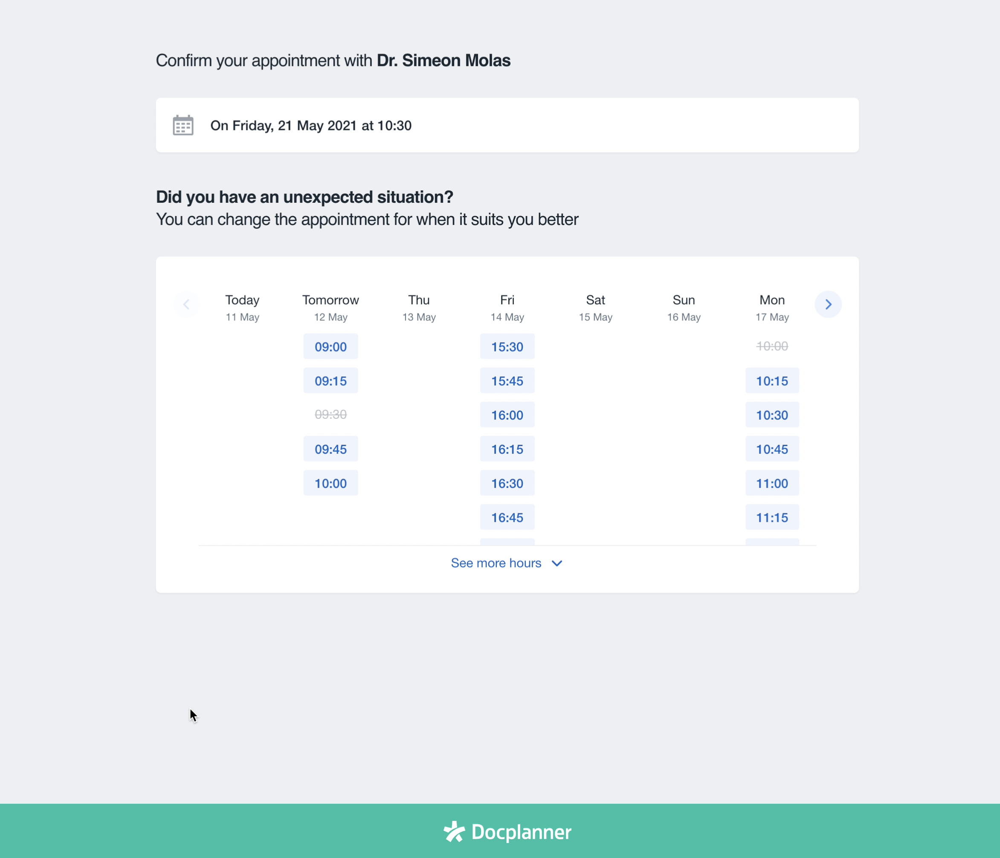

# Docplanner Technical Test

Tech case for DocPlanner hiring process (Frontend with Vue 2024) by Carlos Orbea.

## Notes from the applicant

### Tech stack used

The solution to the tech case provided has been implemented with [Vue 3](https://vuejs.org/) (version fixed in `package.json` by you, not the latest available) using **composition API** and [TypeScript](https://www.typescriptlang.org/).

The store has been implemented with [Pinia](https://pinia.vuejs.org/)

For the API calls I've used [axios](https://axios-http.com/) with some composables and utility functions I'm accustomed to use.

For the styles I've used [PostCss](https://postcss.org/) and [Tailwind](https://tailwindcss.com/).

For unit testing I've used [Vitest](https://vitest.dev/) and [@testing-library/vue](https://testing-library.com/). A coverage report can be generated running
```
yarn test:unit:coverage
```

[vueUse](https://vueuse.org/) has been added for some composables and utilities as well.

[vite-svg-loader](https://github.com/jpkleemans/vite-svg-loader#readme) for SVG handling and icon components

Internationalization has been enabled using [vue-i18n](https://kazupon.github.io/vue-i18n/) for translations

[Husky](https://github.com/typicode/husky#readme) is in place to trigger actions on Git Hooks together with [commitlint](https://commitlint.js.org/) to ensure a standard for the commit format and messages

[date-fns](https://date-fns.org/) has been added to the project to facilitate all the operations with dates

### Project notes and considerations

Please bear in mind this is not a perfect and finished project, but just a first iteration on how I'd approach this challenge. I am very aware that there is plenty of room for improvements, iterations, refactoring and better abstractions. However, I hope it serves to provide you with a glimpse of my thought process and analysis of a project and how I tackle and implement it.

- I haven't added **vue router** to the project as I considered that given its size and domain it wasn't necessary. Of course, if this were part of a larger application, the entire module would have its own route and view.
- The **Pinia** store module contains most of the business logic and API request handle. Of course this could have been abstracted into a composable, but given the nature of Pinia modules it would have been basically the same. Plus Pinia offers a better way of tracking and debugging it on devTools on dev time. I am aware that the logic involving the pinia module, the dates utility functions and API request handling could have been abstracted and reorganized better in a future reiteration, most likely in smaller and separated dedicated composables/ modules.
- The project includes some **unit testing**, but it is not fully tested due obvious time limitations. However I've tested the most relevant parts (store module, key components) so that you can find a sample of every usual testing scenario/ challenge in a project like this.
- I tried to stick to the **layout and visuals** provided by the picture and video as much as I could. Nevertheless, without detailed designs (like a Figma or so) it is hard to nail it 100%. This is applicable to the mobile view, which I have purposely neglected in favour of the logic and others aspect as a mobile view design would've been of much help here.
- In this same topic and as it wasn't mandatory, I have decided not to use time on implementing the **slider animation** when navigating between weeks as it would have required either way more hours to implement from scratch or use some pre-built component (using libraries like Vuetify) and integrate it.
- The code is ready to use internationalization and translations, although it may require some minor tweaks to adjust it.
- I've extended a bit the eslint rules and applied some editor tools to lint everything and format it on save.
- I've also set some git hooks with Husky to enforce a commit message standard and to prevent any pushes to the remote repository if the unit tests fail.

## Assignment instructions

Welcome onboard!

As you may have already seen, we really like to experiment and iterate here at Docplanner and just now we’re dealing
with a new amazing feature for our users: **reschedule an appointment!**

So your first task with us will be to develop a fast prototype for a small app that allows our patients to reschedule an
existing appointment. This is the design:



<sup><i>You can see a preview of a working application with all the features at the end of the readme.</i></sup>

As you can see, when the users access the app they see basic data about the current appointment: the doctor and the
date. As initial data, suppose you had an appointment with **Dr. Simeon Molas** on **Friday, May 21th at 10:30**.

The available slots for the next seven days are shown, starting from today. Only a few slots are initially shown but
there is a button to “See more hours” under them. Some of the slots may be **Taken**, so they’re not available to the
patient to book.

The user could explore future weeks, but not past weeks, by using the right and left arrows on the header of the
calendar. Whenever he finds a slot he’d like to book, he just clicks on it and the appointment and confirm. If the
reschedule is successful, the date of the appointment is updated. Since the user clicks the slot until he gets an
answer, a loading spinner with crossed-out date to be changed will appear.

In order to get and manipulate the data you’ll have to use our API.

Basically the GET where you'll retrieve slots for a maximum of seven days:

- https://draliatest.azurewebsites.net/api/availability/GetWeeklySlots/{yyyyMMdd}

And the POST with an example of the request’s body used on the endpoint:

- https://draliatest.azurewebsites.net/api/availability/BookSlot

```
{
  "Start": Start timestamp (string "YYYY-MM-DD HH:mm:ss"),
  "End": End timestamp (string "YYYY-MM-DD HH:mm:ss"),
  "Comments": Additional instructions for the doctor (string),
  "Patient" : {
    "Name" : Patient Name (string),
    "SecondName" : Patient SecondName (string),
    "Email" : Patient Email (string),
    "Phone" : Patient Phone (string)
  }
}
```

## Notes

Keep in mind that this is a prototype, we don’t expect from you to get the best possible solution but the best you could
do **in a few hours**, so your criteria is important. **The solution should work for every day of the week**.

Although it’s just a prototype, we’d like to see some structure on your code. Treat it more as a large-scale production
application — show your best skills, so we can know you better.

We’ll look at how you use the framework/libraries, architecture, text coverage, readability, maintainability,
performance, adherence to best coding practices. If you skip some of those, please provide comments, so we know what's
your approach.

Animations on going forward, backward or on see more slots are not mandatory.

In order to make it easier for you, we’ll provide a boilerplate you can start the project with. Feel free to use any
library that it could fit to your solution. Also, boilerplate could be outdated, don't hesitate to update it or totally
remove it.

## Our expectations

Use the framework you feel comfortable with.

#### To start from boilerplate you can execute:

```
yarn install && yarn serve
```

## Preview


